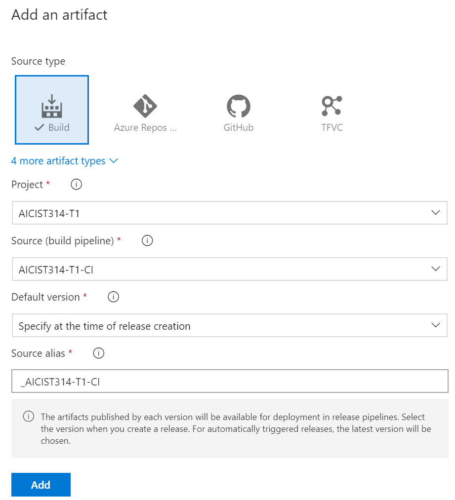

# Task 3 - Modify the environment

*Estimated time to completion: 35 minutes*

# Task 2 - The pipeline

This task will guide you through the process of creating an infrastructure build and release pipeline. While the full project also creates a separate pipeline for the DSC Composite Resource module, the same principles apply so that we will concentrate on the build process of your IaaS workloads.  

This task assumes that you have access to dev.azure.com in order to create your own project and your own pipeline.  

*By the way: You can use the PowerShell module [AutomatedLab.Common](https://github.com/automatedlab/automatedlab.common) to automate your interactions with TFS,VSTS and Azure DevOps*

## 2.1 Create a new project in Azure DevOps

Whether you work with a test environment or at a customer location, you will need a repository for your infrastructure definitions - a project. Let's see how that works.

1. Navigate to <https://dev.azure.com> in a browser of your choice and log in.
2. Click on the "Create project" button in the upper right corner and fill out the basics. It does not matter if it is a public or private repository for this lab.  
    *New projects automatically use git as version control system.*
3. On the left-hand side, select Repos -> Files and then at the top menu, select your repository and click on "Import repository". As the clone url, use <https://github.com/automatedlab/dscworkshop> without authorization.  
    
4. Wait for a couple of seconds and navigate to your code. All project branches, most notably master and dev, have been imported. You should already be familiar with the structure from [task 1](Task1.md)

At the moment, this project does not do anything. However, you have started with one important component: Source code control for your infrastructure. From now on, every change to an infrastructure component needs to be committed, and every change can be accounted for.

## 2.2 Create a new build pipeline

Again, this step can easily be automated. If you are interested in how this may look like, take a look at the [project code](../Lab/03.31%20New%20Release%20Pipleine%20CommonTasks.ps1) in either of the pipeline lab scripts. We are using a hashtable containing all build tasks and pass it to the cmdlets exposed by AutomatedLab.Common.  

Our template approach also consists of using a trusted, internal (i.e. private) gallery for PowerShell modules. Internal does not necessarily mean on-premises, but means a gallery that you trust in which is usually self-hosted.

To do it the manual way, follow the next steps:

1. In your repository, click on the "Set up build" button
2. On the "Select a template" page, select the "Empty pipeline".
3. Our build process can run on the hosted agent. On premises, you might want to select a dedicated agent pool for DSC configuration compilation jobs for example. Add the first agent job by clicking the plus icon. From the list of tasks, select PowerShell.  
    
4. Next, we would like to publish all test results. In the last task you have triggered a manual build and saw the test cases that were executed. On each build an NUnit XML file is generated that Azure DevOps can pick up on. Add another agent task, this time "Publish Test Results". Make sure that it is configured to use NUnit and to pick up the correct file.  
    
5. As a last step, we need to make sure that all build artifacts (MOF, meta.MOF and modules) are published. These artifacts will be used in the release and can be published on an Azure Automation DSC pull server, an on-premises pull server or actively pushed to your infrastructure.  
    Add one step for each of the following artifact types:  
    
    |DisplayName|Path|Artifact name|  
    |---|---|---|  
    |MOF|$(Build.SourcesDirectory)\DscSample\BuildOutput\MOF|MOF|  
    |Meta.MOF|$(Build.SourcesDirectory)\DscSample\BuildOutput\MetaMof|MetaMof|  
    |Modules|$(Build.SourcesDirectory)\DscSample\BuildOutput\CompressedModules|CompressedModules|  
6. At the moment, our build has no triggers. Navigate to the Triggers tab and enable the continuous integration trigger. The branch filters should include master and dev.
7. Once done, just select Save & queue to kick off your first infrastructure build. Click on the build number (e.g. Build #1) to jump to the build console, lie back and wait for the artifacts to be built.

Explore the build output a little while and move on to the next exercise once you are satisfied. You could for example have a look at the tests tab and examine the test results.

## 2.3 Trigger an automatic build

With your CI trigger set up, every change that is committed to the repository invariably starts a new build process - including all test cases. Try it yourself!

1. Either clone your repository locally or change a file online. For example, change to the dev branch and modify the file DSCFile01.yml:  
    ```powershell
    cd $home
    git clone https://dev.azure.com/<YourAccountNameHere>/<YourProjectNameHere/dscworkshop
    (Get-Content ./dscworkshop/dscsample/dsc_configdata/allnodes/dev/dscfile01.yml) -replace 'Location.*','Location: Buxtehude' |
    Set-Content -Path ./dscworkshop/dscsample/dsc_configdata/allnodes/dev/dscfile01.yml
    ```  
    or if your prefer:  
    
2. Stage and commit your changes locally. No build will be started yet, until you push your changes or, if using a forked repository, raise a pull request:
    ```powershell
    cd dscworkshop
    git add .
    git commit -m "DSCFile01 changed its location"

    # Examine the output of git log to see your local commit in the history of all commits
    git log
    ```
3. Push your committed changes by executing ```git push``` and switch back to Azure DevOps to witness the build being started. Navigate to Pipelines -> Builds to see the build history.

## 2.4 Create the release pipeline

While the build process is already a first important step towards infrastructure automation you can trust in, the CD bit of your pipeline is also important. The created artifacts should be automatically deployed to your infrastructure after all. By utilizing staging rings we can move the build artifacts securely through the infrastructure.

If you are using our on-premises lab script to try it on your own, the environment already contains an on-premises DSC pull server. Adapting this to use Azure Automation DSC or any other DSC pull server is trivial.

1. First of all, navigate to "Pipelines\Releases" on the right-hand side and select "New pipeline".
The template selection will pop up. Select "Empty job".

1. Once your pipeline is created, notice that the Artifacts are yet to be filled. Select "Add an artifact" and use the output of your build. A successful build will now trigger your pipeline.  
    
3. Rename 'Stage 1' to 'Dev'. Add two additional stages (environemnts), called 'pilot' and 'production', each with an empty job.

The design of the pipeline depends very much on where it should operate. Your build steps might have included copying the files to an Azure blob storage instead of an on-premises file share. This would be the recommended way in case you want your Azure Automation DSC pull server to host the MOF files. The release step would be to execute New-AzAutomationModule with the URIs of your uploaded, compressed modules.

For now, we will only upload the MOF files to Azure Automation, but you can add a similar release task for uploading the modules for example.

1. Open your first stage, dev, and navigate to variables. For the dev stage, we want for example to deploy to the dev automation account. Variables you add here are available as environment variables. By selecting the appropriate scope, you can control the variable contents for each stage.  
    
2. Add a new 'Azure PowerShell' task. In the task select your subscription and authorize Azure DevOps to access your subscription.
    
    Add the following inline script:  
    ```powershell
    if (Get-Command Enable-AzureRmAlias -ea silentlycontinue)
    {
        Enable-AzureRmAlias
    }

    foreach ( $config in (Get-ChildItem -Path $env:SYSTEM_DEFAULTWORKINGDIRECTORY -Recurse -File -Filter *.mof | Where-Object -Property Name -notmatch "(meta|schema)\.mof"))
    {
        Import-AzureRmAutomationDscNodeConfiguration -ResourceGroupName $env:ResourceGroupname -AutomationAccountName $env:AutomationAccountName -Path $config.FullName -ConfigurationName $config.BaseName -Verbose -Force
    }
    ```  
    The simple script works with the artifacts from the build process and uploads them as new DSC configurations to your Azure Automation Account. This is only one of the many ways you could use your artifacts at this stage.  
    Another approach can be to actively push configurations out to all nodes to immediately receive feedback that could be consumed by Pester tests.

You can trigger a new release either manually or automatically after a build has successfully finished. If you have an automation account set up, you can try it out! Simply set up your build variables properly and observe.  

Congratulations! You have successfully created your first, very simple CI/CD pipeline to deploy your infrastructure as code. Now go on, make this project your own and help your company or your customers succeed!