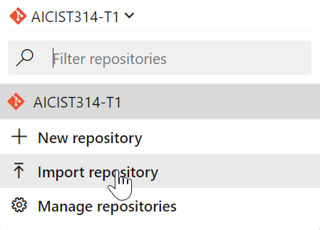

# Task 2 - The pipeline

*Estimated time to completion: 35 minutes*

This task will guide you through the process of creating an infrastructure build and release pipeline. While the full project also creates a separate pipeline for the DSC Composite Resource module, the same principles apply so that we will concentrate on the build process of your IaaS workloads.  

This task assumes that you have access to dev.azure.com in order to create your own project and your own pipeline.  

*By the way: You can use the PowerShell module [AutomatedLab.Common](https://github.com/automatedlab/automatedlab.common) to automate your interactions with TFS,VSTS and Azure DevOps*

***Remember to check the [prerequisites](..\CheckPrereq.ps1)!***

## Create a new project in Azure DevOps

Whether you work with a test environment or at a customer location, you will need a repository for your infrastructure definitions - a project. Let's see how that works.

1. Navigate to <https://dev.azure.com> in a browser of your choice and log in.
2. Click on the "Create project" button in the upper right corner and fill out the basics. It does not matter if it is a public or private repository for this lab.  
    *New projects automatically use git as version control system.*
3. On the left-hand side, select Repos -> Files and then at the top menu, select your repository and click on "Import repository". As the clone url, use <https://github.com/automatedlab/dscworkshop> without authorization.  
    
4. Wait for a couple of seconds and navigate to your code. All project branches, most notably master and dev, have been imported. You should already be familiar with the structure from [task 1](../Task1/Exercise1.md)

At the moment, this project does not do anything. However, you have started with one important component: Source code control for your infrastructure. From now on, every change to an infrastructure component needs to be committed, and every change can be accounted for.

Please continue with [Exercise 2](Exercise2.md) when your are ready.
