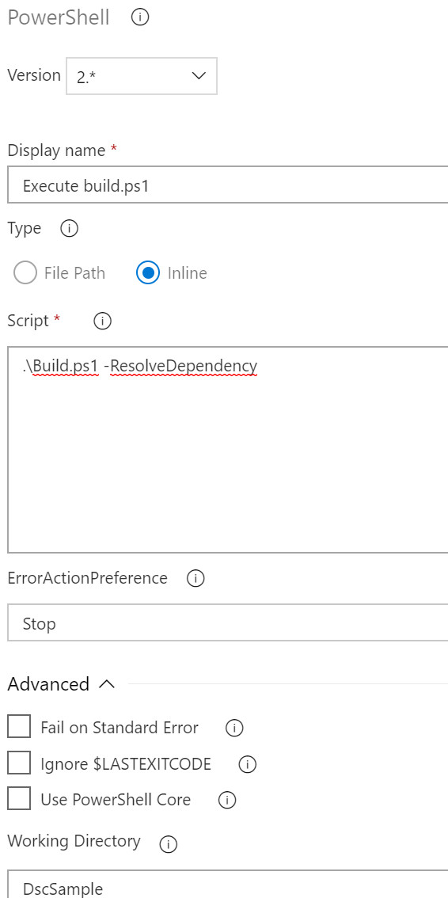

# Task 2 - The pipeline

*Estimated time to completion: 35 minutes*

This task assumes that you have access to dev.azure.com in order to create your own project and your own pipeline.  

*By the way: You can use the PowerShell module [AutomatedLab.Common](https://github.com/automatedlab/automatedlab.common) to automate your interactions with TFS,VSTS and Azure DevOps*

***Remember to check the [prerequisites](..\CheckPrereq.ps1)!***

## Create a new build pipeline

Again, this step can easily be automated. If you are interested in how this may look like, take a look at the [project code](../Lab/03.31%20New%20Release%20Pipleine%20CommonTasks.ps1) in either of the pipeline lab scripts. We are using a hashtable containing all build tasks and pass it to the cmdlets exposed by AutomatedLab.Common.  

Our template approach consists of using a trusted, internal (i.e. private) gallery for PowerShell modules. Internal does not necessarily mean on-premises, but means a gallery that you trust in which is usually self-hosted.

In the previous exercise, you have created a new Azure DevOps project to collaborate on your infrastructure code. While this is not strictly necessary, CI tools like Azure DevOps add features like RBAC, a nice interface and boast huge flexibility.

*Info: To start small, just use ```git init [--bare]``` to create a repository you can collaborate in as well.*

To create your own build (Continuous Integration) pipeline, follow the next steps:

1. In your repository, click on the "Set up build" button
1. On the "Select a template" page, select the "Empty pipeline".
2. Our build process can run on the hosted agent. A build agent is just a small service/daemon running on a VM that is capable of executing scripts and so on. 
    
    On premises, you might want to select a dedicated agent pool for DSC configuration compilation jobs for example. Add the first agent job by clicking the plus icon. From the list of tasks, select PowerShell and make sure that the following settings are correct:
    - Display name: Execute build.ps1
    - Type: Inline
    - Script: .\Build.ps1 -ResolveDependency
    - Working Directory: DSC

    

1. Next, we would like to publish all test results. In the last task you have triggered a manual build and saw the test cases that were executed. On each build an NUnit XML file is generated that Azure DevOps can pick up. To do so, add another agent task, this time "Publish Test Results". Make sure that it is configured to use NUnit and to pick up the correct file (**/IntegrationTestResults.xml).

    

1. Now we do exacly the same like in the previous step but for the build acceptance test results. You can clone the task "Publish Interation Test Results" and adapt the fields 'Dispay name' and 'Test results files'. The name of the file this task is looking for is '**/BuildAcceptanceTestResults.xml'.

    
1. As a last step, we need to make sure that all build artifacts (MOF, meta.MOF and modules) are published. These artifacts will be used in the release and can be published on an Azure Automation DSC pull server, an on-premises pull server or actively pushed to your infrastructure.  

    Add one "Publish Build Artifact" step for each of the following artifact types:  
    
    |DisplayName|Path|Artifact name|  
    |---|---|---|  
    |MOF|$(Build.SourcesDirectory)\DSC\BuildOutput\MOF|MOF|  
    |Meta.MOF|$(Build.SourcesDirectory)\DSC\BuildOutput\MetaMof|MetaMof|  
    |Modules|$(Build.SourcesDirectory)\DSC\BuildOutput\CompressedModules|CompressedModules|
    |RSOP|$(Build.SourcesDirectory)\DSC\BuildOutput\RSOP|RSOP|
1. At the moment, our build has no triggers. Navigate to the Triggers tab and enable the continuous integration trigger. The branch filters should include master and dev.  

    Setting up a CI trigger enables your project to be built every time someone checks in changes to code. This can be a new branch, a pull request from a fork or code committed to master or dev.
1. Once done, just select "Save & queue" to kick off your first infrastructure build. Click on the build number (e.g. Build #1) to jump to the build console, lie back and wait for the artifacts to be built.

Explore the build output a little while and move on to the next exercise once you are satisfied. You could for example have a look at the tests tab and examine the test results.

Please continue with [Exercise 3](Exercise3.md) when your are ready.
