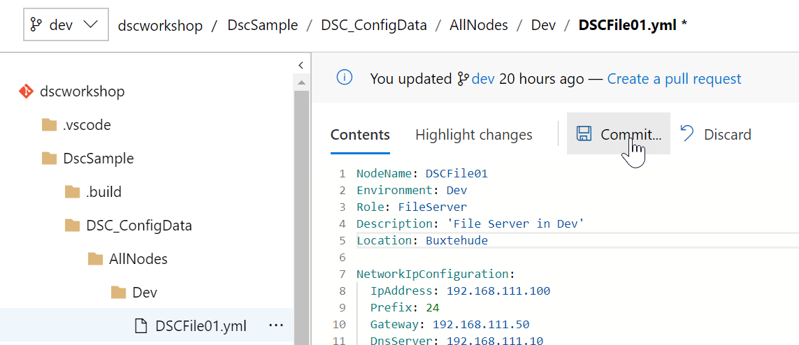

# Task 2 - The pipeline

*Estimated time to completion: 35 minutes*

This task assumes that you have access to dev.azure.com in order to create your own project and your own pipeline.  

*By the way: You can use the PowerShell module [AutomatedLab.Common](https://github.com/automatedlab/automatedlab.common) to automate your interactions with TFS,VSTS and Azure DevOps*

***Remember to check the [prerequisites](..\CheckPrereq.ps1)!***

## Trigger an automatic build

With your CI trigger set up from the previous exercise, every change that is committed to the repository invariably starts a new build process - including all test cases. Try it yourself!

1. Either clone your repository locally or change a file online. For example, change to the dev branch and modify the file DSCFile01.yml:  
    ```powershell
    cd $home
    git clone https://dev.azure.com/<YourAccountNameHere>/<YourProjectNameHere/dscworkshop
    (Get-Content ./dscworkshop/dscsample/dsc_configdata/allnodes/dev/dscfile01.yml) -replace 'Location.*','Location: Buxtehude' |
    Set-Content -Path ./dscworkshop/dscsample/dsc_configdata/allnodes/dev/dscfile01.yml
    ```  
    or if your prefer:  
    
2. Stage and commit your changes locally. No build will be started yet, until you push your changes or, if using a forked repository, raise a pull request:
    ```powershell
    cd dscworkshop
    git add .
    git commit -m "DSCFile01 changed its location"

    # Examine the output of git log to see your local commit in the history of all commits
    git log
    ```
3. Push your committed changes by executing ```git push``` and switch back to Azure DevOps to witness the build being started. To do so, navigate to Pipelines -> Builds to see the build history.

Please continue with [Exercise 4](Exercise4.md) when your are ready.
