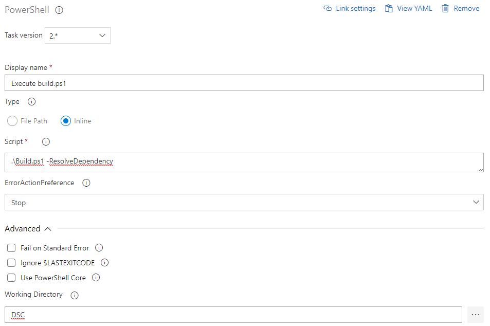

# Task 2 - The pipeline

*Estimated time to completion: 35 minutes*

This task assumes that you have access to dev.azure.com in order to create your own project and your own pipeline.  

*By the way: You can use the PowerShell module [AutomatedLab.Common](https://github.com/automatedlab/automatedlab.common) to automate your interactions with TFS,VSTS and Azure DevOps*

***Remember to check the [prerequisites](../CheckPrereq.ps1)!***

## Create a new build pipeline

> Note: In the exercise we do not use a YAML pipeline but the old graphical way of defining one. This way is better for learning how a pipeline can be defined and how things work. Later you surely want to switch to YAML.

Again, this step can easily be automated. ~~If you are interested in how this may look like, take a look at the [project code](../../Lab/31%20New%20Release%20Pipeline%20CommonTasks.ps1) in either of the pipeline lab scripts. We are using a hashtable containing all build tasks and pass it to the cmdlets exposed by AutomatedLab.Common.~~

Our template approach consists of using a trusted, internal (i.e. private) gallery for PowerShell modules. Internal does not necessarily mean on-premises, but means a gallery that you trust in which is usually self-hosted.

In the previous exercise, you have created a new Azure DevOps project to collaborate on your infrastructure code. While this is not strictly necessary, CI tools like Azure DevOps add features like RBAC, a nice interface and boast huge flexibility.

>Info: To start small, just use ```git init [--bare]``` to create a repository you can collaborate in as well.*

To create your own build (Continuous Integration) pipeline, follow the next steps:

1. In your repository, on the left side click on Pipelines -> Builds and then on the button 'New pipeline'.

2. Now you are asked: Where is your code? Please choose 'Other Git'.

3. The next menu lets you 'Select a source'. Please select 'Azure Repos Git'. The required information will be added automatically. Please switch the 'Default branch for manual and scheduled builds' to 'dev' and press the 'Continue' button.

4. On the "Select a template" page, select the "Empty pipeline" which is on the very bottom the last time this documentation was updated.

You have created an empty pipeline now. The next tasks will give the pipeline some work to do.

Our build process can run on the hosted agent. A build agent is just a small service/daemon running on a VM that is capable of executing scripts and so on. A new VM is deployed every time you start a build and destroyed once the build is finished.

On premises, you might want to select a dedicated agent pool for DSC configuration compilation jobs for example.

5. Add the first agent job by clicking the plus icon next to 'Agent job 1'. From the list of tasks, select PowerShell and make sure that the following settings are correct:
    - Display name: Execute build.ps1
    - Type: Inline
    - Script: .\Build.ps1 -ResolveDependency
    - Working Directory: DSC

    

6. Next, we would like to publish all test results. In the last task you have triggered a manual build and saw the test cases that were executed. On each build an NUnit XML file is generated that Azure DevOps can pick up. To do so, add another agent task, this time "Publish Test Results". Make sure that it is configured to use NUnit and to pick up the correct file: ```**/IntegrationTestResults.xml```.

    

7. Now we do exactly the same like in the previous step but for the build acceptance test results. You can clone the task "Publish Interation Test Results" and adapt the fields 'Display name' and 'Test results files'. The name of the file this task is looking for is ```**/BuildAcceptanceTestResults.xml```.

8. As a last step, we need to make sure that all build artifacts (MOF, meta.MOF and modules) are published. These artifacts will be used in the release and can be published on an Azure Automation DSC pull server, an on-premises pull server or actively pushed to your infrastructure.  

    Add one "Publish Build Artifact" step for each of the following artifact types:  

    |DisplayName|Path|Artifact name|  
    |---|---|---|  
    |MOF|$(Build.SourcesDirectory)\DSC\BuildOutput\MOF|MOF|  
    |Meta.MOF|$(Build.SourcesDirectory)\DSC\BuildOutput\MetaMof|MetaMof|  
    |Modules|$(Build.SourcesDirectory)\DSC\BuildOutput\CompressedModules|CompressedModules|
    |RSOP|$(Build.SourcesDirectory)\DSC\BuildOutput\RSOP|RSOP|

9. At the moment, our build has no triggers. Navigate to the 'Triggers' tab and enable the continuous integration trigger. The branch filters should include 'master' and 'dev' or just '*'.  

    Setting up a CI trigger enables your project to be built every time someone checks in changes to code. This can be a new branch, a pull request from a fork or code committed to 'master' or 'dev'.

10. Once done, just select "Save & queue" to kick off your first infrastructure build. In the next 'Run pipeline dialog' just take the defaults and click on 'Save and run. Once you have done this, the next page tells you about 'Preparing an agent for the job' and 'Waiting for the request to be queued'. Lie back and wait for the artifacts to be built.

    > Note: If you create and / or compile software on a dedicated development machine or your personal computer, you pile up a lot of dependencies: Programs, helper tools, DLLs, PowerShell modules, etc. All these things may be required to run you code. In the previous task we have introduced you to [PSDepend](https://github.com/RamblingCookieMonster/PSDepend). This helper module makes sure that we have all the dependencies downloaded that are defined in the \*PSDepend*.psd1 file(s). If your software can be build on a standard build worker, it can be build everywhere and does not have any unwanted and undocumented dependencies.

11. Hopefully each build step is green. If the job is finished, you have the 'Artifacts' button in the upper right corner. Explore the build output a little while and move on to the next exercise once you are satisfied. Also quite interesting are the test results that you may want to examine.

    >Note: All successful tests are hidden, only failed ones are shown by default. Just remove the filter to get the full view.

Please continue with [Exercise 3](Exercise3.md) when your are ready.
