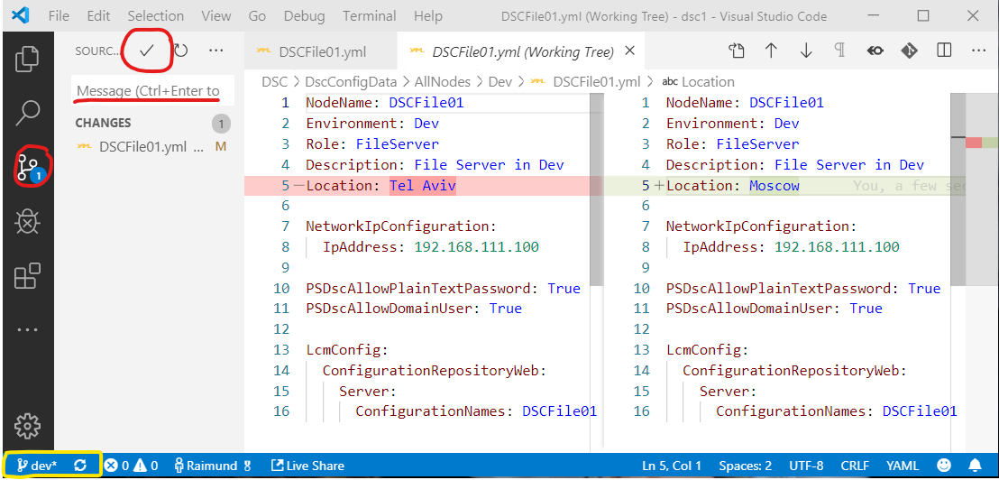

# Task 2 - The pipeline

*Estimated time to completion: 35 minutes*

This task assumes that you have access to dev.azure.com in order to create your own project and your own pipeline.  

*By the way: You can use the PowerShell module [AutomatedLab.Common](https://github.com/automatedlab/automatedlab.common) to automate your interactions with TFS,VSTS and Azure DevOps*

***Remember to check the [prerequisites](../CheckPrereq.ps1)!***

## Trigger an automatic build

With your CI trigger set up from the previous exercise, every change that is committed to the repository invariably starts a new build process - including all test cases. Try it yourself!

1. There are two ways to edit a file. Please change the location of the node 'DSCFile01' using one of the following methods:

    ### The Azure DevOps web editor

    The quick one is just using the web editor in Azure DevOps. This is ok for a     small test but this method does not scale and you can easily do mistakes.

    

    If you have changed the location, press the 'Commit' button. By default, this     change goes to the 'dev' branch.

    ### Working with a local clone

    If you really want to work with a source code repository, first thing is to     create a local clone. You can do all you changes locally, review them and push     them back to the repository.

    In Visual Studio Code you can clone a repository by pressing ```F1``` and     navigating to the command 'Git: Clone'. You need to provide the repository's URL     and a local target folder.

    You will get the URL from the Azure DevOps Repos -> Files page or you can start     the clone project right from there.

    

    After the cloning is finished, you will be asked if 'you [would] like to open     the cloned repository, or add it to the current workspace?'. Please choose     'Open'.

    After you have altered the location in the 'DSCFile01.yml', save the file and     see the change in the source control area:

    >**Note: Please monitor the changes in the yellow marked are.**

    

    Enter a commit message and then click the 'Commit' button. You will be asked     'Would you like to automatically stage all your changes and commit them directly?    ', please click 'Yes'.

    Now you have done a change in the local repository. This is indicated in the     area at the left bottom that was marked yellow in the screenshot. You see 0     incoming and 1 outgoing change. If you click on that area, you will be asked     "This action will push and pull commits to and from 'origin/dev'". Click yes, to     push the changes to the Azure DevOps repo.

    >**Info:** Alternatively you could have used the git command to do the same on     the command line like this:

    ```powershell
    git add .
    git commit -m "DSCFile01 changed its location"

    # Examine the output of git log to see your local commit in the history of all     commits
    git log -n 1

    #to see the actual change that was committed but not yet pushed
    git show HEAD

    git push
    ```

2. Switch back to Azure DevOps to witness the build being started. To do so, navigate to Pipelines -> Builds to see the build history.

Please continue with [Exercise 4](Exercise4.md) when your are ready.
