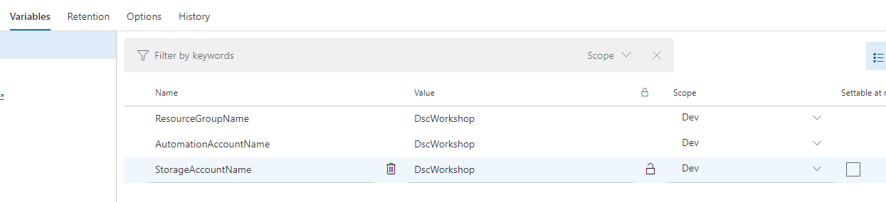
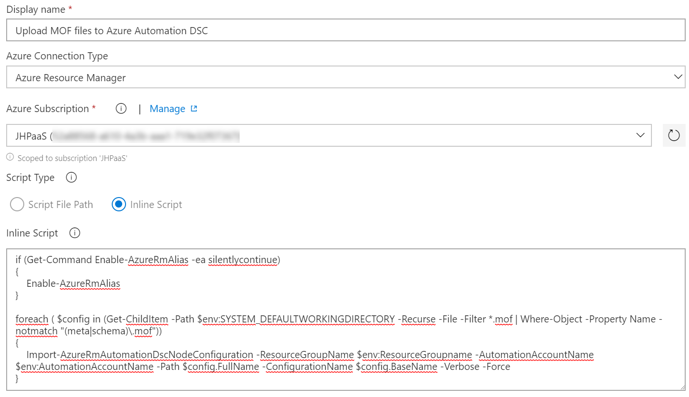
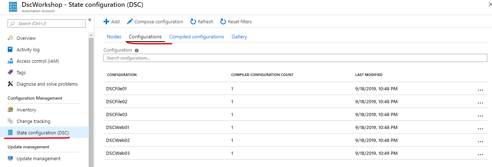

# Task 2 - The pipeline

*Estimated time to completion: 35 minutes*

This task will guide you through the process of creating an infrastructure build and release pipeline. While the full project also creates a separate pipeline for the DSC Composite Resource module, the same principles apply so that we will concentrate on the build process of your IaaS workloads.  

This task assumes that you have access to dev.azure.com in order to create your own project and your own pipeline.  

*By the way: You can use the PowerShell module [AutomatedLab.Common](https://github.com/automatedlab/automatedlab.common) to automate your interactions with TFS,VSTS and Azure DevOps*

***Remember to check the [prerequisites](../CheckPrereq.ps1)!***

## Create the release pipeline

>**Note: If you do not have created an Azure Automation Account, please do that before starting with the following exercise. The Azure Automation Account should be named 'DscWorkshop' in a new resource group named 'DscWorkshop'.**

While the build process is already a first important step towards infrastructure automation you can trust in, the CD bit of your pipeline is also important. The created artifacts should be automatically deployed to your infrastructure after all. By utilizing staging rings we can move the build artifacts securely through the infrastructure.

If you are using our on-premises lab script to try it on your own, the environment already contains an on-premises DSC pull server. Adapting this to use Azure Automation DSC or any other DSC pull server is trivial.

1. First of all, navigate to "Pipelines -> Releases" on the right-hand side and select "New pipeline".
The template selection will pop up. Select "Empty job" on the very top.

1. Once your pipeline is created, notice that the Artifacts are yet to be filled. Select "Add an artifact" and use the output of your build. A successful build will now trigger your pipeline.


> Note: The names may vary depending on the name you have given to the project.

1. Rename 'Stage 1' to 'Dev'. Add two additional stages (environments), called 'Test' and 'Production', each with an empty job.

The design of the pipeline depends very much on where it should operate. Your build steps might have included copying the files to an Azure blob storage instead of an on-premises file share. This would be the recommended way in case you want your Azure Automation DSC pull server to host the MOF files. The release step would be to execute New-AzAutomationModule with the URIs of your uploaded, compressed modules.

For now, we will only upload the MOF files to Azure Automation, but you can add a similar release task for uploading the modules for example.

1. Open your first stage, dev, and navigate to variables. For the dev stage, we want for example to deploy to the dev automation account. Variables you add here are available as environment variables in the release process. The environment variables are used later by the PowerShell scripts. By selecting the appropriate scope, you can control the variable contents for each stage.

    Please add the following variables to the 'Dev' stage:

    |Name | Value
    |-|-|
    ResourceGroupName | DscWorkshop
    AutomationAccountName | DscWorkshop
    StorageAccountName | DscWorkshop

    

    ---

1. Add a new 'Azure PowerShell' task for uploading the MOF files to the Azure automation account.

    > Note: In the task select your subscription and authorize Azure DevOps to access your subscription.

    - Select a meaningful display name.
    - Select the Azure subscription you have created your Azure Automation Account in.
    - Select the script type 'Inline script'.
    - Paste the following script into the space named 'Inline Script'.
    - Azure PowerShell Version should be 'Latest installed version'.

    This is the inline script:

    ```powershell
    if (Get-Command Enable-AzureRmAlias -ea SilentlyContinue)
    {
        Enable-AzureRmAlias
    }

    $path = "$($env:SYSTEM_ARTIFACTSDIRECTORY)\$($env:RELEASE_PRIMARYARTIFACTSOURCEALIAS)\MOF"

    foreach ($config in (Get-ChildItem -Path $path -Filter *.mof ))
    {
        Import-AzureRmAutomationDscNodeConfiguration -ResourceGroupName $env:ResourceGroupName -AutomationAccountName $env:AutomationAccountName -Path $config.FullName -ConfigurationName $config.BaseName -Verbose -Force
    }
    ```

    Your new task should look like this:
    

    The simple script works with the artifacts from the build process and uploads them as new DSC configurations to your Azure Automation Account. This is only one of the many ways you could use your artifacts at this stage.

    Another approach can be to actively push configurations out to all nodes to immediately receive feedback that could be consumed by Pester tests.

    ---

1. Add a new 'Azure PowerShell' task for uploading the compressed modules to the Azure automation account

    This is almost the same as for the previous task for uploading the MOF files but this time we want to upload the compressed modules. These modules are required to apply the DSC configuration on the nodes. After a node has downloaded its configuration (MOF) from the automation account, it will look for the modules referenced in the configuration. If the automation account does not provide the required modules, applying the configuration will fail.

    - Select a meaningful display name.
    - Select the Azure subscription you have created your Azure Automation Account in.
    - Select the script type 'Inline script'.
    - Paste the following script into the space named 'Inline Script'.
    - Azure PowerShell Version should be 'Latest installed version'.

    This is the script for uploading the modules:

    ```powerShell
    $resourceGroupName = $env:ResourceGroupName
    $storageAccountName = $env:StorageAccountName 
    $automationAccountName = $env:AutomationAccountName
    $storageContainerName = 'DscModules'

    $path = "$($env:SYSTEM_ARTIFACTSDIRECTORY)\$($env:RELEASE_PRIMARYARTIFACTSOURCEALIAS)\CompressedModules"

    if (Get-Command Enable-AzureRMAlias -ErrorAction SilentlyContinue)
        {
            Enable-AzureRMAlias
        }

    #-------------------------

    $storageAccountName = $storageAccountName.ToLower()
    $storageContainerName = $storageContainerName.ToLower()

    $storageAccount = Get-AzureRMStorageAccount -ResourceGroupName $resourceGroupName -Name $storageAccountName -ErrorAction SilentlyContinue
    if (-not $storageAccount)
    {
        $storageAccount = New-AzureRMStorageAccount -ResourceGroupName $resourceGroupName -Name $storageAccountName -Location WestEurope -SkuName Standard_GRS
    }

    $ctx = $storageAccount.Context
    Set-AzureRMCurrentStorageAccount -ResourceGroupName $resourceGroupName -Name $storageAccountName | Out-Null

    $storageContainer = Get-AzureStorageContainer -Name $storageContainerName -Context $ctx -ErrorAction SilentlyContinue
    if (-not $storageContainer)
    {
        $storageContainer = New-AzureStorageContainer -Name $storageContainerName -Context $ctx -Permission Blob
    }

    $modules = Get-ChildItem -Path $path -Filter *.zip
    $moduleJobs = foreach ($module in $modules)
    {
        Write-Host "Uploading module '$module' to storage account'"
        $blob = Set-AzureStorageBlobContent –Container $storageContainerName -File $module.FullName -Blob $module.Name -Force

        $moduleUrl = $blob.ICloudBlob.Uri.AbsoluteUri
        $moduleName = $module.BaseName.Split('_')[0]

        Write-Host "Creating new module '$module' in Azure Automation Account"
        New-AzureRMAutomationModule -Name $moduleName -ResourceGroupName $resourceGroupName -AutomationAccountName $automationAccountName -ContentLinkUri $moduleUrl
    }

    Write-Host "Uploading $($moduleJobs.Count) modules to Azure..." -NoNewline
    do
    {
        $moduleJobs = $moduleJobs | Get-AzureRMAutomationModule | Where-Object { $_.ProvisioningState -ne 'Succeeded' }
        Start-Sleep -Seconds 5
        Write-Host . -NoNewline
    }
    while ($moduleJobs)
    Write-Host finished

    Write-Host "Removing storage container '$($storageContainer.Name)'."
    $storageContainer | Remove-AzureStorageContainer -Force
    ```

    ---

    You can trigger a new release either manually or automatically after a build has successfully finished. If you have an automation account set up, you can try it out! Simply set up your build variables properly and observe.

1. Examine what the release process has done in your Azure Automation Account. Please click on your Azure Automation Account and then on the menu 'Configuration Management -> State configuration (DSC)'. So far, no nodes have been onboarded yet so the numbers here are not that interesting. But if you click on 'Configurations', things get more interesting.

    

Congratulations! You have successfully created your first, very simple CI/CD pipeline to deploy your infrastructure as code. Now go on, make this project your own and help your company or your customers succeed!

Please continue with [Exercise 5](Exercise5.md) when your are ready.
