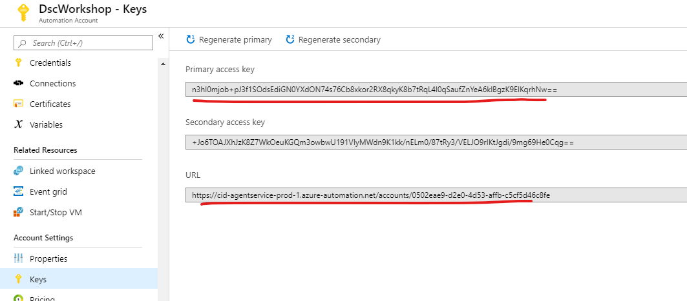
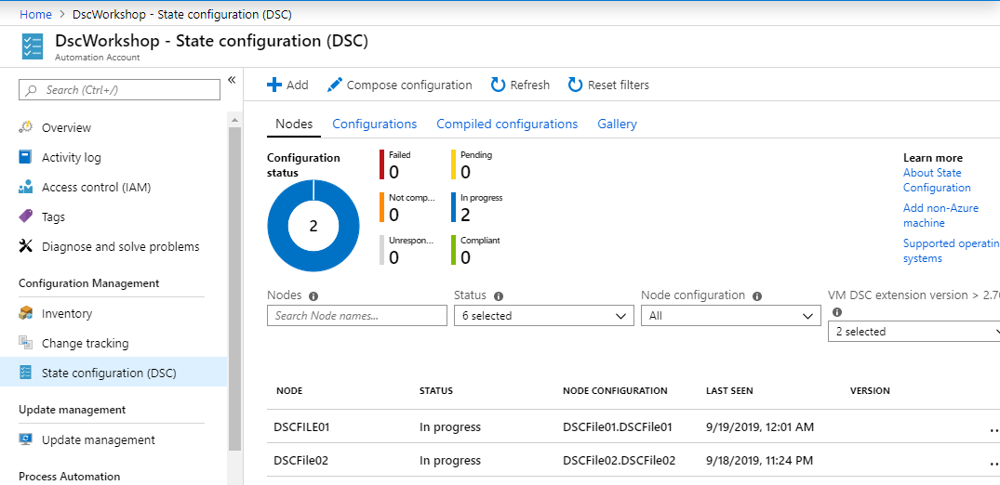

# Task 2 - The pipeline

*Estimated time to completion: 35 minutes*

This task will guide you through the process of creating an infrastructure build and release pipeline. While the full project also creates a separate pipeline for the DSC Composite Resource module, the same principles apply so that we will concentrate on the build process of your IaaS workloads.  

This task assumes that you have access to dev.azure.com in order to create your own project and your own pipeline.  

*By the way: You can use the PowerShell module [AutomatedLab.Common](https://github.com/automatedlab/automatedlab.common) to automate your interactions with TFS, VSTS and Azure DevOps*

***Remember to check the [prerequisites](../CheckPrereq.ps1)!***

## Onboarding a node with the Azure DSC pull server

1. Please create a machine in Azure or on hour local Hyper-V named 'DSCFile01'. The operating system should be Windows 2016 or 2019.

1. Please open an PowerShell ISE on the new virtual machine and paste the following code into a new empty script window:

    ```powershell
    # The DSC configuration that will generate meta configurations
    [DscLocalConfigurationManager()]
    Configuration DscMetaConfigs
    {
        param
        (
            [Parameter(Mandatory=$True)]
            [String]$RegistrationUrl,

            [Parameter(Mandatory=$True)]
            [String]$RegistrationKey,

            [Parameter(Mandatory=$True)]
            [String[]]$ComputerName,

            [Int]$RefreshFrequencyMins = 30,

            [Int]$ConfigurationModeFrequencyMins = 15,

            [String]$ConfigurationMode = 'ApplyAndMonitor',

            [String]$NodeConfigurationName,

            [Boolean]$RebootNodeIfNeeded= $False,

            [String]$ActionAfterReboot = 'ContinueConfiguration',

            [Boolean]$AllowModuleOverwrite = $False,

            [Boolean]$ReportOnly
        )

        if(!$NodeConfigurationName -or $NodeConfigurationName -eq '')
        {
            $ConfigurationNames = $null
        }
        else
        {
            $ConfigurationNames = @($NodeConfigurationName)
        }

        if($ReportOnly)
        {
            $RefreshMode = 'PUSH'
        }
        else
        {
            $RefreshMode = 'PULL'
        }

        Node $ComputerName
        {
            Settings
            {
                RefreshFrequencyMins           = $RefreshFrequencyMins
                RefreshMode                    = $RefreshMode
                ConfigurationMode              = $ConfigurationMode
                AllowModuleOverwrite           = $AllowModuleOverwrite
                RebootNodeIfNeeded             = $RebootNodeIfNeeded
                ActionAfterReboot              = $ActionAfterReboot
                ConfigurationModeFrequencyMins = $ConfigurationModeFrequencyMins
            }

            if(!$ReportOnly)
            {
            ConfigurationRepositoryWeb AzureAutomationStateConfiguration
                {
                    ServerUrl          = $RegistrationUrl
                    RegistrationKey    = $RegistrationKey
                    ConfigurationNames = $ConfigurationNames
                }

                ResourceRepositoryWeb AzureAutomationStateConfiguration
                {
                ServerUrl       = $RegistrationUrl
                RegistrationKey = $RegistrationKey
                }
            }

            ReportServerWeb AzureAutomationStateConfiguration
            {
                ServerUrl       = $RegistrationUrl
                RegistrationKey = $RegistrationKey
            }
        }
    }

    # Create the meta configurations
    # NOTE: DSC Node Configuration names are case sensitive in the portal.
    # TODO: edit the below as needed for your use case
    $Params = @{
        RegistrationUrl = '<fill me in>';
        RegistrationKey = '<fill me in>';
        ComputerName = @('<some VM to onboard>', '<some other VM to onboard>');
        NodeConfigurationName = 'SimpleConfig.webserver';
        RefreshFrequencyMins = 30;
        ConfigurationModeFrequencyMins = 15;
        RebootNodeIfNeeded = $False;
        AllowModuleOverwrite = $False;
        ConfigurationMode = 'ApplyAndMonitor';
        ActionAfterReboot = 'ContinueConfiguration';
        ReportOnly = $False;  # Set to $True to have machines only report to AA DSC but not pull from it
    }

    # Use PowerShell splatting to pass parameters to the DSC configuration being invoked
    # For more info about splatting, run: Get-Help -Name about_Splatting
    DscMetaConfigs @Params
    ```

    Then please replace the values 'RegistrationUrl' and 'RegistrationKey' with the values you get in the automation account's key section.

    The computer name is the 'DSCFile01' and 'NodeConfigurationName' will be 'DSCFile01.DSCFile01'.

    

1. Please execute the script by pressing the run button or `F5`. The result is a Meta.MOF file that configures the machines DSC local configuration manager to pull configurations from the Azure Automation DSC pull server.

1. Use the following command to actually apply the Meta.MOF file where the path is the one that was returned in the previous activity.

    ```powershell
    Set-DscLocalConfigurationManager -Path C:\Users\Install.contoso\DscMetaConfigs -Verbose
    ```

    The output the command `Set-DscLocalConfigurationManager` returns should look like this:

    ```code
    VERBOSE: Performing the operation "Start-DscConfiguration: SendMetaConfigurationApply" on target "MSFT_DSCLocalConfigurationManager".
    VERBOSE: Perform operation 'Invoke CimMethod' with following parameters, ''methodName' = SendMetaConfigurationApply,'className' = MSFT_DSCLocalConfigurationMana
    ger,'namespaceName' = root/Microsoft/Windows/DesiredStateConfiguration'.
    VERBOSE: An LCM method call arrived from computer DSCFILE01 with user sid S-1-5-21-2125349222-571551423-62964463-1000.
    VERBOSE: [DSCFILE01]: LCM:  [ Start  Set      ]
    VERBOSE: [DSCFILE01]: LCM:  [ Start  Resource ]  [MSFT_DSCMetaConfiguration]
    VERBOSE: [DSCFILE01]: LCM:  [ Start  Set      ]  [MSFT_DSCMetaConfiguration]
    VERBOSE: [DSCFILE01]: LCM:  [ End    Set      ]  [MSFT_DSCMetaConfiguration]  in 0.0160 seconds.
    VERBOSE: [DSCFILE01]: LCM:  [ End    Resource ]  [MSFT_DSCMetaConfiguration]
    VERBOSE: [DSCFILE01]:                            [] Registration of the Dsc Agent with the server https://cid-agentservice-prod-1.azure-automation.net/accounts/
    0502eae9-d2e0-4d53-affb-c5cf5d46c8fe was successful.
    VERBOSE: [DSCFILE01]:                            [] Registration of the Dsc Agent with the server https://cid-agentservice-prod-1.azure-automation.net/accounts/
    0502eae9-d2e0-4d53-affb-c5cf5d46c8fe was successful.
    VERBOSE: [DSCFILE01]:                            [] Registration of the Dsc Agent with the server https://cid-agentservice-prod-1.azure-automation.net/accounts/
    0502eae9-d2e0-4d53-affb-c5cf5d46c8fe was successful.
    VERBOSE: [DSCFILE01]: LCM:  [ End    Set      ]
    VERBOSE: [DSCFILE01]: LCM:  [ End    Set      ]    in  0.4370 seconds.
    VERBOSE: Operation 'Invoke CimMethod' complete.
    VERBOSE: Set-DscLocalConfigurationManager finished in 1.053 seconds.
    ```

1. In max 30 minutes the node will pull the new configuration from the Azure pull server. If you don't want to wait that long, use this command:

    ```powershell
    Update-DscConfiguration -Wait -Verbose
    ```

    After the node has applied the configuration, have a look at the Azure DSC pull serer. The onboarded node should be visible there:

    

Great! Your release pipeline worked!
